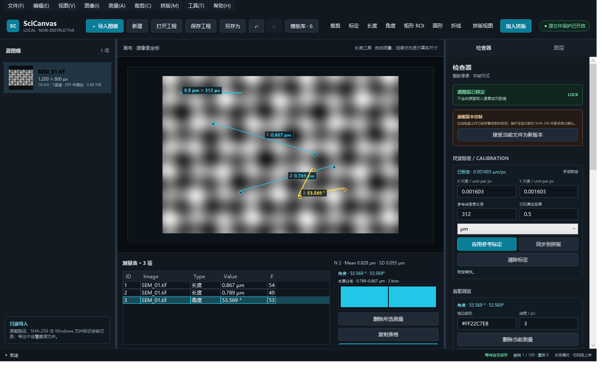
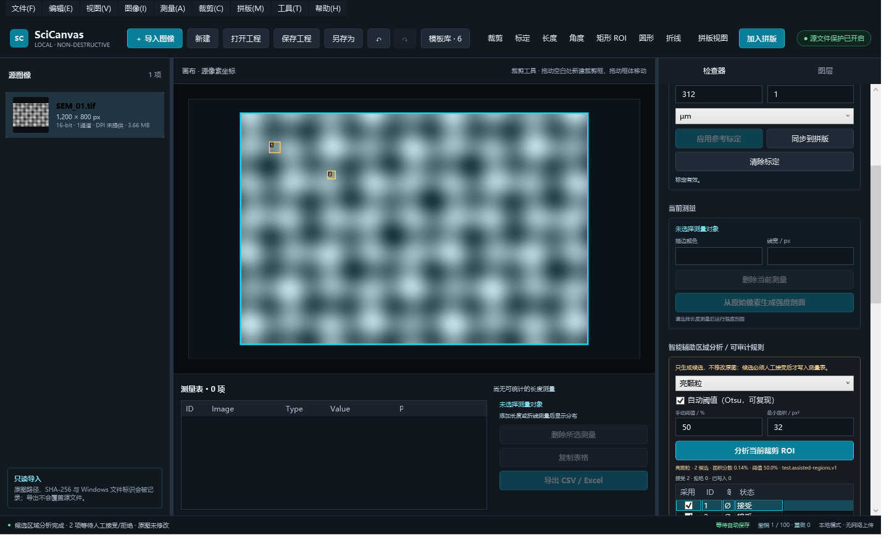

# SciCanvas v1.2.2-alpha 发布验收台账

验收日期：2026-08-24
目标平台：Windows x64，.NET 10，WPF
工程格式：`1.2`

## 结论

分阶段升级路线的阶段 0–6 已完成，`v1.2.1-alpha` 进一步补齐画布缩放/平移、裁剪手柄、统一图层选择与测量对象编辑，`v1.2.2-alpha` 修复空工程显示默认裁剪框、空白区域无法创建裁剪、缩放手柄未释放鼠标捕获以及拖动时反复序列化历史快照的问题。Release 构建、自动化回归、核心界面视觉证据、成品 CLI、实际安装、包内容、版本号与 SHA-256 均通过发布门禁。此版本保持科研图像源文件只读，自动分析结果默认只是候选，必须经人工接受后才能进入测量数据。

## 自动化回归

执行命令：

```powershell
dotnet test .\SciCanvas.sln --configuration Release --no-restore
```

| 测试程序集 | 通过 | 失败 | 跳过 |
| --- | ---: | ---: | ---: |
| SciCanvas.Core.Tests | 44 | 0 | 0 |
| SciCanvas.Platform.Windows.Tests | 98 | 0 | 0 |
| 合计 | 142 | 0 | 0 |

覆盖范围包括标定与科学测量、工程 `1.2` 往返/迁移、撤销与审计、Figure QC、16-bit/位图/PDF/SVG 导出、强度剖面、XLSX、Inset、可解释辅助分析、CLI、WPF 主界面与像素坐标导出。

`v1.2.2-alpha` 新增回归覆盖：空工程的源图视口和默认裁剪层必须折叠；空白画布的真实 WPF 鼠标按下事件必须建立新裁剪；缩放手柄的真实 WPF 鼠标抬起事件必须释放捕获；一次裁剪边界更新只产生一次语义变更；连续 200 次指针更新在松开前不生成历史快照，松开时只提交一个可撤销步骤。

## DPI、缩放与键盘检查

- 导出层继续以 96 WPF 设备单位到目标 DPI 的显式换算进行像素定位；300 dpi 下的面板、箭头、形状、文字、比例尺和 Inset 有像素级回归覆盖。
- WPF 布局回归覆盖常见显示器缩放后的逻辑视口：`1920×1080 @ 125%`、`1920×1080 @ 150%`、`3840×2160 @ 200%`、`3840×2160 @ 250%`。检查器保持可测量和纵向滚动。
- `Ctrl+S`、`Ctrl+Z`、`Ctrl+Enter` 等核心键盘绑定在上述每种逻辑视口中均保持注册；完整快捷键清单见 README。
- 自动化检查验证的是等效逻辑视口，不替代在多显示器之间动态切换 per-monitor DPI 的真机测试；后者作为从 alpha 晋级稳定版前的硬件兼容性复测项保留。

## 视觉差异台账

| 证据 | 预期 | 实际观察 | 未解释偏差 |
| --- | --- | --- | --- |
| `docs/assets/scicanvas-v1.2-stage1.png`（1440×900） | 标定、长度/角度测量、测量表与统计同屏可见 | 深色工作台清晰；参考标定线、两条长度与角度覆盖层可辨；右侧 Calibration 和底部测量/直方图信息一致 | 无 |
| `docs/assets/scicanvas-v1.2-stage5-assisted.png`（1440×900） | 辅助分析规则、参数、候选覆盖层与候选表可复核 | 两个候选框与表格对应；模式、Otsu、阈值、最小面积和“可审计规则”可见；底部操作可通过检查器滚动到达 | 无 |





两张截图均由真实 WPF 视图回归测试重新生成。历史文件 `artifacts/SciCanvas-ui-smoke.png` 内容不属于 SciCanvas，不作为验收证据。

## 发布包核验

| 产物 | 字节数 | SHA-256 |
| --- | ---: | --- |
| `SciCanvas-v1.2.2-alpha-Portable.zip` | 65,634,851 | `736C101B49676C054036F7CA7B3D23B277478E81404AC90C9D2C31988A518627` |
| `SciCanvas-v1.2.2-alpha-Setup.exe` | 181,704,894 | `D6118B7531537654634A0DC131E45730ABCF5CBA227572F4A33EDEEDF6FB340D` |

- GUI、CLI、Setup 的文件版本均为 `1.2.2.0`，产品语义版本为 `1.2.2-alpha+2290ad34b7cfc5cbf24b510f3a110d06a5e302f8`。
- 便携包根目录包含 `SciCanvas.App.exe`、`SciCanvas.Cli.exe`、`Install-SciCanvas.cmd`、`Install-SciCanvas.ps1` 与 `README.txt`。
- 便携包共核验 424 个 ZIP 条目，没有绝对路径、盘符路径或 `..` 路径穿越项。
- 从发布目录执行 `SciCanvas.Cli.exe --help` 返回退出码 `0`。
- 安装器在重定向到 `D:\Temp` 的隔离用户目录中返回退出码 `0`，生成 266 个安装文件和开始菜单快捷方式；安装后的 CLI 返回退出码 `0`，GUI 成功显示 `未命名工程 · SciCanvas` 后正常关闭。
- `SciCanvas-v1.2.2-alpha-SHA256.txt` 已使用实际成品复算，两项均匹配。

## 智能辅助边界

v1.2 的“智能”能力是可解释的阈值、连通域、几何和一致性规则，不声称使用不可解释模型。候选包含算法 ID、模式、ROI、阈值、最小面积和候选 ID；接受/拒绝都写入审计记录。软件不提供生成式填充、克隆、局部擦除或对象移除。
